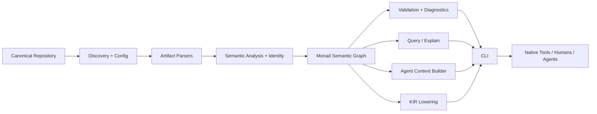
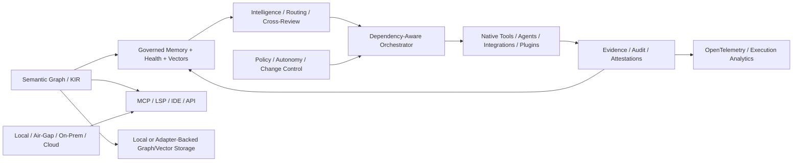

# Architecture Overview

**Status:** Expanded product baseline

## Architectural thesis

Monad has a deterministic semantic kernel surrounded by governed control, execution, observation, intelligence, integration, and interaction surfaces. AI reasoning is a consumer and producer of proposals/context/evidence, not part of the trusted compilation core. Post-MVP autonomy extends execution authority only through explicit policy, progressive trust, sandboxing, review, and auditable evidence.

## Responsibility planes

### Knowledge Plane

Discovers, parses, normalizes, identifies, links, validates, and stores/query-compiles engineering knowledge. Owns semantic graph, KIR, provenance, memory-state classification, graph health, and multi-vector semantic contracts.

### Control Plane

Interprets configuration, policy, authorization, Work Packet scope, lifecycle state, readiness/done gates, autonomy levels, ownership/resources, cryptographic/attestation requirements, change control, and planning/acceptance constraints. Decides what is permitted/required but delegates native mechanics.

### Execution Plane

Builds dependency-aware execution plans and invokes native tools, adapters, plugins, integrations, and agents with controlled environment, worktree/branch isolation, cancellation, retries/idempotency, circuit breakers, caching, budgets, and evidence capture. Parallel execution may improve throughput but cannot make canonical result/evidence ordering nondeterministic.

### Intelligence Plane

Selects governed memory/context, routes work across approved AI providers/local models, coordinates bounded agents, performs cross-harness review, computes explainable intelligence/health indicators, and participates in a memory–intelligence–execution feedback loop. It cannot silently promote probabilistic output to canonical truth.

### Observation Plane

Provides diagnostics, provenance, audit, logs/traces/metrics, graph/workspace health, semantic diff, execution history, cost/token data where available, attestation evidence, and explainability. OpenTelemetry-compatible correlation uses stable Work Packet/execution/evidence identities where applicable.

### Integration Plane

Owns explicit resource/adapter contracts, MCP, LSP/IDE, plugin SDK/registry/packs, graph/vector storage adapters, automation integrations, and optional external runtime compatibility profiles. Third-party semantics do not leak into the deterministic core without an accepted canonical adapter/specification contract.

### Interaction Plane

CLI first; later TUI/IDE/MCP/API/web/dashboards/projections. Optional hosted/shared surfaces may add RBAC/passkeys, custom domains, analytics, deployment, and collaboration, but interaction surfaces do not redefine semantic truth.

## MVP logical components

## Expanded logical evolution

## Key boundaries

- **Canonical input boundary:** filesystem/Git content is untrusted input; reading does not imply execution.
- **Semantic boundary:** parsed syntax becomes typed engineering meaning only through explicit deterministic rules.
- **KIR boundary:** canonical downstream interchange has versioned schema/compatibility rules before stability is promised.
- **Memory boundary:** canonical, derived, proposed, uncertain, stale, contradictory, superseded, cached, vector, and external evidence states remain distinguishable.
- **Agent boundary:** context is selected from semantic authority and cannot expand implementation permission.
- **Autonomy boundary:** stronger agent authority is policy-gated, evidence-earned, reviewable, reversible, and never inferred from model confidence alone.
- **Execution boundary:** native commands/agents/integrations/plugins are explicit, observable, bounded, cancellable where possible, and preserve result/evidence.
- **Trust boundary:** attestations, identities, keys, multi-party approval, policy decisions, and audit evidence use versioned cryptographic/governance contracts.
- **Provider boundary:** AI/cloud/storage/integration providers are replaceable consumers/adapters rather than semantic authorities.
- **Deployment boundary:** local/offline remains valid; air-gapped/on-prem/cloud/shared surfaces add explicit operational/security contracts.

## State

Canonical repository content is durable source. Derived graph/KIR/cache/vector/dashboard state is rebuildable unless explicitly recorded as external evidence. Local state under `.monad/` must distinguish canonical configuration, lock/resolution state, evidence, and disposable caches. Corrupt derived state must never require reconstructing intent manually.

Hosted/multi-tenant state must additionally identify workspace/tenant, classification, retention, provenance, and isolation. File/media content is content-addressed where feasible and governed separately from ordinary text context.

## Incrementality and learning

Source/content identity and dependency relationships enable semantic diff and minimal invalidation. Post-MVP learning uses accepted execution/review evidence to improve routing, health, score, and proposed context selection, but learning outputs remain derived until explicitly governed into canonical authority.

## Deployment

MVP favors a single local distributable CLI/runtime with internally modular components. Post-MVP profiles may add containers, Nix, air-gapped/on-prem, and optional AWS/GCP/Azure services. Remote services, external storage, and multi-tenant controls are optional. Repository splitting and distributed runtime boundaries require evidence rather than anticipation.

## AI architecture

Human architecture/planning/review and bounded implementation agents remain complementary. Monad should produce context/execution/review contracts from semantic authority. Multi-provider routing can choose hosted or local models by capability, policy, privacy, cost, and latency. No LLM response becomes accepted engineering authority without an explicit canonical artifact/approval transition.

## Security architecture

Default behaviors minimize context and execution authority. Parsing untrusted repositories avoids arbitrary code execution. Paths, symlinks, plugins, external commands, integrations, files, caches, prompts, model-provider boundaries, workspaces/tenants, keys, and remote deployment are explicit threat surfaces. Secret masking, prompt-injection containment, capability sandboxing, signed attestations, key rotation, and post-quantum migration profiles are layered capabilities rather than assumptions inside the semantic kernel.

## Performance architecture

Performance is benchmark-profile driven. The architecture supports dependency/conflict-aware parallelism and scalable caches while preserving deterministic state/evidence ordering. Long-range targets include at least 10,000 lightweight internal scheduler/graph operations per second and 400 ms p95 eligible local governed-state finalization once required inputs are available on declared reference hardware. External tool/provider/network latency is measured separately and cannot be hidden inside these claims.

## Ecosystem evolution

Plugins, registries, packs, MCP/LSP, external graph/vector storage, automation integrations, external runtime profiles, and hosted controls layer on through versioned capability contracts. Modular-first evolution precedes repository/service splitting. An optional EVM bytecode compatibility profile, if implemented, is an isolated adapter and never a core semantic dependency.
