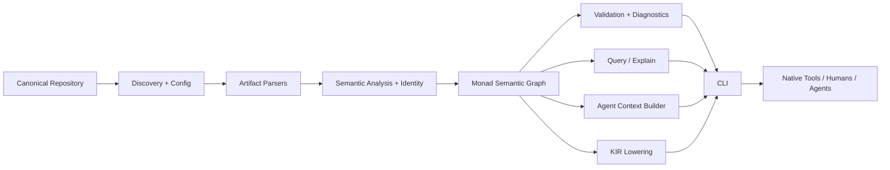

# Architecture Overview

**Status:** Proposed stabilization baseline

## Architectural thesis

Monad has a deterministic semantic kernel surrounded by adapters and interaction surfaces. AI reasoning is a consumer and producer of proposals/context, not part of the trusted compilation core.

## Responsibility planes

### Knowledge Plane

Discovers, parses, normalizes, identifies, links, validates, and stores/query-compiles engineering knowledge. Owns semantic graph and KIR contracts.

### Control Plane

Interprets configuration, policy, authorization, Work Packet scope, lifecycle state, and planning/acceptance constraints. Decides what is permitted/required but delegates native mechanics.

### Execution Plane

Builds execution plans and invokes native tools/adapters with controlled environment, cancellation, caching, and evidence capture.

### Observation Plane

Provides diagnostics, provenance, logs/traces/metrics where relevant, semantic diff, execution evidence, and explainability.

### Interaction Plane

CLI first; later TUI/IDE/API/web/projections. Interaction surfaces do not redefine semantic truth.

## MVP logical components

## Key boundaries

- **Canonical input boundary:** filesystem/Git content is untrusted input; reading does not imply execution.
- **Semantic boundary:** parsed syntax becomes typed engineering meaning only through explicit deterministic rules.
- **KIR boundary:** canonical downstream interchange has versioned schema/compatibility rules before stability is promised.
- **Agent boundary:** context is selected from semantic authority and cannot expand implementation permission.
- **Execution boundary:** native commands are explicit, observable, cancellable where possible, and preserve exit/evidence.

## State

Canonical repository content is durable source. Derived graph/KIR/cache state is rebuildable. Local state under `.monad/` must distinguish canonical configuration, lock/resolution state, and disposable caches. Corrupt derived state must never require reconstructing intent manually.

## Incrementality

MVP may rebuild modest repositories, but architecture records source/content identity and dependency relationships so semantic diff and minimal invalidation can be added without changing the knowledge model.

## Deployment

MVP favors a single local distributable CLI/runtime with internally modular components. Remote services are optional later. Repository splitting and distributed runtime boundaries require evidence rather than anticipation.

## AI architecture

ChatGPT is strongest at architecture/planning/review; Codex at bounded implementation. Monad should eventually produce their context contracts itself. No LLM response becomes accepted engineering authority without an explicit canonical artifact/approval transition.

## Security architecture

Default behaviors minimize context and execution authority. Parsing untrusted repositories must avoid arbitrary code execution. Paths, symlinks, plugins, external commands, generated artifacts, caches, and model-provider boundaries are explicit threat surfaces.

## Evolution

The MVP semantic kernel establishes stable concepts first. Plugins, registries, remote execution, cross-repository knowledge, and hosted controls layer on through versioned contracts rather than being embedded into the initial core.