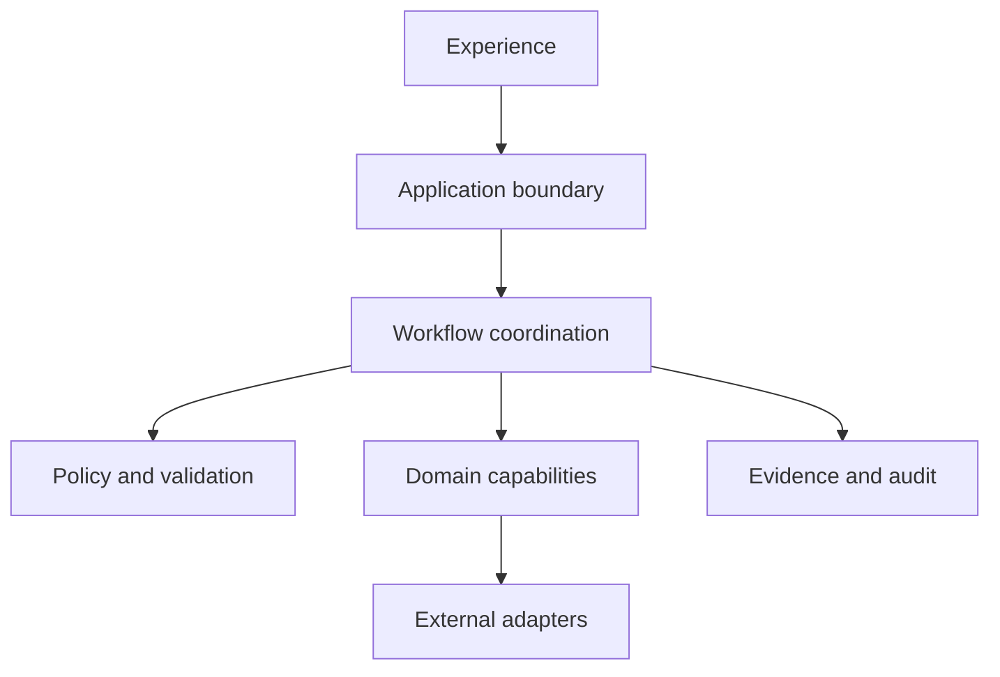

# Architecture Overview

## Drivers

The architecture supports one traceable journey from authenticated intent to a
verified result. The strongest drivers are correctness, explicit workflow
state, least privilege, interruption recovery, diagnosability, accessibility,
and the ability to evolve internals without silently breaking user promises.

## Logical view

### Experience

Delivers the supported user and operator interactions. It owns presentation,
local interaction state, and accessibility behavior, but not authoritative
workflow state or security policy.

### Application boundary

Authenticates request context, applies coarse transport protections, validates
contract shape, coordinates application use cases, and maps domain outcomes to
versioned interface responses. It is not the source of domain truth.

### Workflow coordination

Owns workflow identity, allowed state transitions, idempotency, durable
progress, timeouts, retries, compensation, and escalation. It invokes domain
capabilities through ports and records outcome-relevant transitions.

### Policy and validation

Evaluates versioned structural, semantic, authorization, and safety rules. A
decision includes the rule version, outcome, explanation safe for its audience,
and evidence reference.

### Domain capabilities

Own business invariants and authoritative domain state. Domain behavior is
isolated from transport, storage, vendor SDKs, and user-interface concerns.

### Evidence and audit

Stores minimum necessary, append-oriented records for security, outcome, and
control reconstruction. Evidence access is separately authorized and retention
is enforced by classification.

### External adapters

Translate explicit ports to identity, persistence, messaging, notification, or
other external dependencies. Adapters contain vendor-specific behavior and
failure translation so dependencies remain replaceable.

## Primary flow

1. The experience submits an authenticated request with an idempotency key and
   correlation context.
2. The application boundary validates the interface contract and authorization
   context.
3. Workflow coordination creates or returns the existing workflow instance.
4. Policy and domain capabilities validate the proposed action.
5. After required confirmation, the workflow commits work through owned domain
   capabilities and external ports.
6. Evidence records state transitions and relevant policy context.
7. Verification evaluates postconditions before the result is declared
   successful.

## Failure model

Failures are classified as invalid request, unauthorized action, policy denial,
domain conflict, transient dependency failure, permanent dependency failure,
timeout, or internal defect. Each class has an allowed retry and disclosure
policy. Unknown commit status is never represented as a clean failure; it enters
reconciliation or escalation.

## Data and consistency

Each domain capability owns its authoritative data. A transaction does not span
independent ownership boundaries. Cross-boundary workflows use durable state,
idempotent commands, explicit events, and compensation where reversal is
possible. Read views may be eventually consistent and must expose freshness
when a user decision depends on it.

## Deployment view

The initial deployment favors the smallest operable shape: independently
testable modules may run in one deployable unit until scaling, isolation, or
ownership evidence justifies separation. Runtime configuration is externalized,
secrets come from an approved secret store, schema changes are forward-compatible,
and every release supports automated health verification and rollback.

## Cross-cutting controls

Authentication, fine-grained authorization, correlation, structured errors,
telemetry, data classification, configuration validation, rate protection, and
release provenance apply at their owning boundaries. Shared libraries may
standardize mechanics but may not become a hidden source of domain policy.
